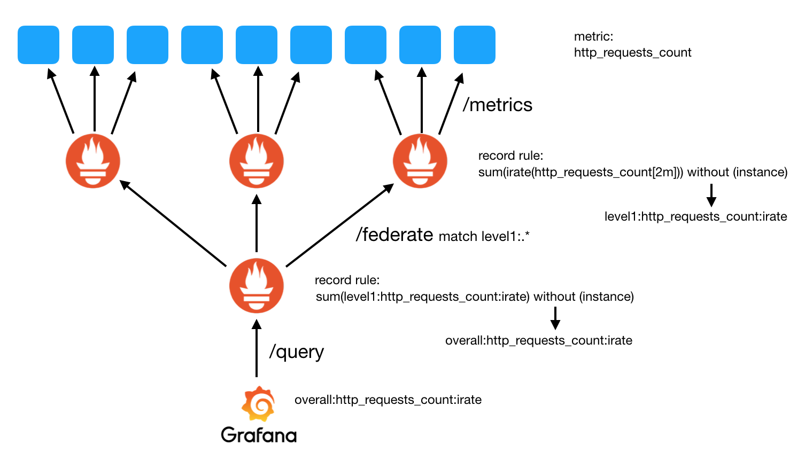
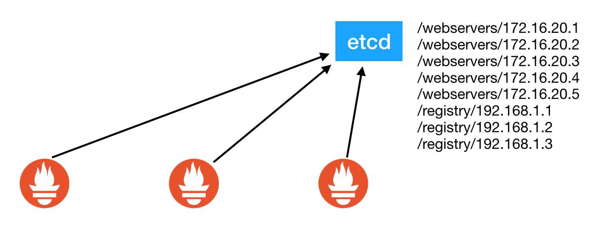

# promster
Prometheus with dynamic clustering and scrape sharding capabilities based on ETCD.

Promster is a process that runs in parallel to Prometheus and operates by changing prometheus.yml and file with lists of hosts/federated Prometheus to be scraped dynamically.

By using record rules and sharding scrape among servers, you can reduce the dimensionality of metrics, keeping then under variability control. Promster manages the list of hosts so that it can be used to configure hierarquical schemes of Prometheus chains for large scale deployments. See an example in diagrams below:





Promster helps you create this kind of Prometheus deployment by helping you create those recording rules, discover scrape targets, discover sibilings, Prometheus instances and then distribute the load across those instances accordingly so that if you scale the number of Prometheus instances the (sharded) load will get distributed over the other instances automatically.

Se an example below:

# Usage

```yml

docker-compose.yml

version: '3.5'

services:

  etcd0:
    image: quay.io/coreos/etcd:v3.2.25
    environment:
      - ETCD_LISTEN_CLIENT_URLS=http://0.0.0.0:2379
      - ETCD_ADVERTISE_CLIENT_URLS=http://etcd0:2379

  generator:
    image: labbsr0x/metrics-generator-tabajara
    environment:
      - COMPONENT_NAME=testserver
      - COMPONENT_VERSION=1.0.0
      - REGISTRY_ETCD_URL=http://etcd0:2379
      - REGISTRY_ETCD_BASE=/webservers
      - REGISTRY_SERVICE=generator
      - REGISTRY_TTL=10
    ports:
      - 3000

  promster-level1:
    image: flaviostutz/promster
    ports:
      - 9090
    environment:
      - LOG_LEVEL=info
      - SCHEME=http
      - TLS_INSECURE=false

      - REGISTRY_ETCD_URL=http://etcd0:2379
      - REGISTRY_ETCD_BASE=/registry
      - REGISTRY_SERVICE=prom-level1
      - REGISTRY_TTL=5

      - SCRAPE_ETCD_URL=http://etcd0:2379
      - SCRAPE_ETCD_PATH=/webservers/generator
      - SCRAPE_INTERVAL=5s
      - SCRAPE_TIMEOUT=3s
      - RETENTION_TIME=30m

      - RECORD_RULE_1_NAME=level1:http_requests_app_total:irate
      - RECORD_RULE_1_EXPR=sum(irate(http_requests_app_total[2m])) without (job,server_name,instance)
      - RECORD_RULE_1_LABELS=site:s1,region:b1

      - EVALUATION_INTERVAL=20s

  promster-level2:
    image: flaviostutz/promster
    ports:
      - 9090
    environment:
      - LOG_LEVEL=info

      - REGISTRY_ETCD_URL=http://etcd0:2379
      - REGISTRY_ETCD_BASE=/registry
      - REGISTRY_SERVICE=prom-level2
      - REGISTRY_TTL=5

      - SCRAPE_ETCD_URL=http://etcd0:2379
      - SCRAPE_ETCD_PATH=/registry/prom-level1
      - SCRAPE_PATHS=/federate
      - SCRAPE_MATCH_REGEX=level1:.*
      - SCRAPE_INTERVAL=5s
      - SCRAPE_TIMEOUT=3s
      - RETENTION_TIME=30m

      - RECORD_RULE_1_NAME=level2:http_requests_app_total:irate
      - RECORD_RULE_1_EXPR=sum(level1:http_requests_app_total:irate) without (job,instance)

      - RECORD_RULE_2_NAME=total:http_requests_app_total:irate
      - RECORD_RULE_2_EXPR=sum(level1:http_requests_app_total:irate)

      - EVALUATION_INTERVAL=20s

  promster-level3:
    image: flaviostutz/promster
    ports:
      - 9090
    environment:
      - LOG_LEVEL=info

      - REGISTRY_ETCD_URL=http://etcd0:2379
      - REGISTRY_ETCD_BASE=/registry
      - REGISTRY_SERVICE=prom-level3
      - REGISTRY_TTL=5

      - SCRAPE_ETCD_URL=http://etcd0:2379
      - SCRAPE_ETCD_PATH=/registry/prom-level2
      - SCRAPE_PATHS=/federate
      - SCRAPE_MATCH_REGEX=level2:.*
      - SCRAPE_INTERVAL=5s
      - SCRAPE_TIMEOUT=3s
      - SCRAPE_SHARD_ENABLE=false
      - RETENTION_TIME=30m

      - RECORD_RULE_1_NAME=level3:http_requests_app_total:irate
      - RECORD_RULE_1_EXPR=sum(level2:http_requests_app_total:irate) without (job,instance)
      
      - EVALUATION_INTERVAL=20s

```

* run ```docker-compose up```

* Launch 20 instances of the target server that is being monitored: ```docker-compose scale generator=20```

* Launch 5 instances of the first layer of Prometheus. Each will be responsible for scraping ~4 servers and for aggregating results: ```docker-compose scale promster-level1=5```

* Launch 2 instances of the second layer of Prometheus. Each will be responsible for scraping ~2-3 federated Prometheus servers (from level1) and for aggregating the results: ```docker-compose scale promster-level2=2```

* run ```docker ps``` and get the dynamic port allocated for container promster_level1

* open browser at http://localhost:[dyn port]/targets and see which scrape targets were associated to this node

* Perform final queries at level3. It will have all the aggregated results of all metrics.

# ENV configurations

* LOG_LEVEL 'info'
* SCRAPE_ETCD_URL etcd URLs to connect to get list of metrics endpoints to be scraped
* SCRAPE_ETCD_PATH base path for services registered
* SCRAPE_PATHS uri for getting metrics. ex.: /metrics
* SCRAPE_MATCH_REGEX when using /federated scrape paths, this regex will be used to match which metrics will be returned by the federate endpoint
* SCRAPE_SHARD_ENABLE Enable sharding distribution among targets so that each Promster instance will scrape a different set of targets, enabling distribution of load among instances. Defaults to true. Use false if you want all instances to scrape the same set of targets. This maybe useful, for example, if you want to create a set of instances with the same data to distribute user queries among instances with the same dataset
* SCRAPE_INTERVAL time between scrapes for automatic scraping
* SCRAPE_TIMEOUT time for a timeout signal

* SCHEME Target's scheme. Either http or https
* TLS_INSECURE Disable validation of the server certificate. Either true or false

* EVALUATION_INTERVAL time between record rules and alerts evaliation
* RETENTION_TIME time during which the data will be stored

* REGISTRY_ETCD_URL etcd URLs to connect to get or register Promster nodes
* REGISTRY_ETCD_BASE base path inside etcd for the service dir
* REGISTRY_SERVICE name of the service used to register nodes on this level
* REGISTRY_TTL expiration time of an entry in ETCD when registering nodes
* if REGISTRY_* ENVs are not defined, no sharding of targets will take place so that all instances will scrape all targets

* RECORD_RULE_1_NAME metric name that will receive contents for expr 1. where '1' maybe any sequential number for multiple rules creation
* RECORD_RULE_1_EXPR expression/query that will generate contents to the metric
* RECORD_RULE_1_LABELS a comma separated list of key/value pairs in the format `labelName:labelValue` to work with Prometheus's label redefinition features
